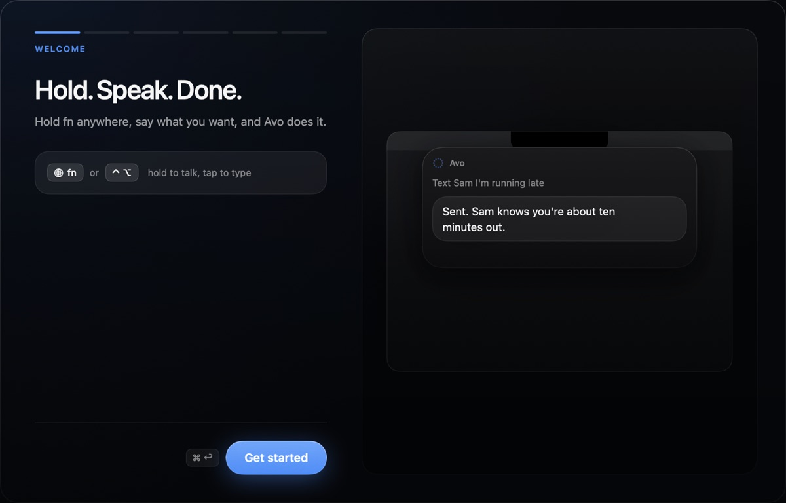
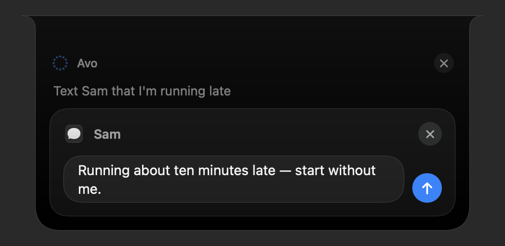
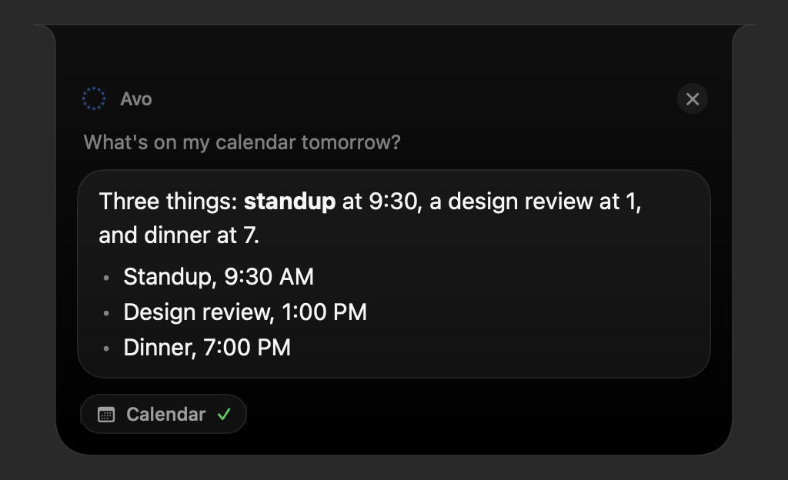
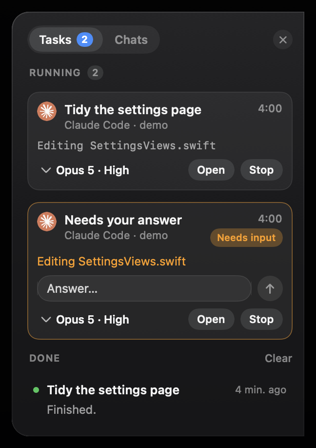

# Avo

**The open-source Mac voice agent. The Siri you never had.**

Avo is the voice assistant who gets things done: hold a key, say it, done. Speech stays on-device.
Bring your own model.



*Step one of six. The rest set your model, permissions and voice.*

Hold your talk key, speak, let go. Avo transcribes on this Mac, looks at your screen when the
request needs it, and acts through your own apps: Messages, Mail, Calendar, Reminders, Notes,
Finder, Spotify, Google Drive, Claude Code and Codex, plus any MCP server you add. Anything that
sends, creates, or changes something shows you an editable card first.

On macOS 26 you can skip the key and say **"Hey Avo"** instead. Avo matches the phrase on this Mac
and sends nothing until it hears it. Hands-free stays off until you turn it on in
**Settings → Voice → Hands-free**, where you can also change the phrase.



*You read and edit every field before Avo sends, creates or deletes anything.*



*Answers that only read data appear in the notch, then it collapses.*



*Long work like Claude Code and Codex moves to the side notch so you can keep talking.*

## Requirements

- macOS 15 or newer, Apple Silicon. macOS 15 support is compile-verified; please report issues.
- The "Hey Avo" wake word needs macOS 26. Everything else works on macOS 15.
- A model: an OpenAI key, or any OpenAI-compatible server (Ollama, LM Studio, OpenRouter, Groq,
  xAI, Anthropic's compatibility endpoint).

## Install

Build from source (needs Xcode 26):

```sh
brew install xcodegen
git clone https://github.com/Stu1124/avo.git && cd avo
scripts/install.sh --now
```

`scripts/install.sh` builds Release and, with `--now`, installs to `/Applications` and relaunches.
Without `--now` it only builds. See [AGENTS.md](AGENTS.md) for signing options. Onboarding walks
through permissions and model setup on first launch.

The first tagged release will carry signed downloads on the [Releases](../../releases) page. An
unsigned build needs a right-click → Open the first time.

## Models

Avo has no account and no server of its own. Point it at whatever you want to run.

| Provider | Style | Base URL | Key |
| --- | --- | --- | --- |
| OpenAI | OpenAI (Responses) | `https://api.openai.com/v1` | yes |
| Ollama | OpenAI-compatible | `http://localhost:11434/v1` | no |
| LM Studio | OpenAI-compatible | `http://localhost:1234/v1` | no |
| OpenRouter | OpenAI-compatible | `https://openrouter.ai/api/v1` | yes |
| Groq | OpenAI-compatible | `https://api.groq.com/openai/v1` | yes |
| xAI | OpenAI-compatible | `https://api.x.ai/v1` | yes |
| Anthropic | OpenAI-compatible | `https://api.anthropic.com/v1` | yes |

Set the style, base URL, key and model id in **Settings → General → Model**. Voice mode (open-mic
conversation) uses the OpenAI Realtime API, so it needs the OpenAI style and an OpenAI key;
everything else works on any of the rows above.

## Permissions

Avo asks for four permissions during onboarding, and for the rest only when a tool needs one. Live
status for all of them is in **Settings → Permissions**.

Up front:

- **Microphone**: hears you while you hold the talk key. Required.
- **Speech Recognition**: turns your speech into text on this Mac. Required.
- **Input Monitoring**: detects the talk key while another app is in front. Can wait.
- **Accessibility**: reads your selected text and the app you are in. Can wait.

Just in time, the first time a tool needs it:

- **Screen Recording**: screen awareness and "what's on my screen".
- **Full Disk Access**: iMessage history, and Desktop/Documents searches without per-folder
  prompts. macOS offers no in-app prompt for this one, so add Avo in System Settings.
- **Reminders**: reading and creating reminders.
- **Calendars**: reading Apple Calendar.
- **Location**: "where am I" and nearby searches.
- **Automation**: driving Messages, Spotify and other apps by Apple Events.

Avo asks for nothing at launch. When a permission is missing, the tool that needed it shows a card
naming it.

## Privacy

Dictation and wake-word detection run on this Mac, through Apple's speech models. Avo does not
upload your audio.

What leaves the Mac, and only when you make a request: the text of that request, the conversation
so far, tool results the model needs to answer, and a screenshot when the request is about your
screen. It goes to the provider you configured. Avo has no backend of its own, so point it at
Ollama or LM Studio and nothing leaves the machine.

Keys live in the macOS Keychain. History, screenshots and logs live in
`~/Library/Application Support/Avo/`. Avo deletes them on the retention window you set in Settings.
**Settings → About → Export diagnostics** writes a zip with the log and a settings dump; secrets
are listed as present or absent, never included.

## MCP servers

Put servers in `~/Library/Application Support/Avo/mcp.json`:

```json
{
  "servers": {
    "linear": { "command": "npx", "args": ["-y", "linear-mcp"] },
    "remote": { "url": "https://example.com/mcp", "headers": { "Authorization": "Bearer …" } }
  }
}
```

Their tools reach the model as `mcp_<server>_<tool>`, and anything that writes gets a confirmation
card. **Settings → Apps** lists every server with its transport, tool count or startup error, an
on/off switch, and a form for adding one without editing the file.

## Coding agents

"Have Claude fix the flaky test in my-project" dispatches Claude Code; "run Codex on the notes
project to …" dispatches Codex. Progress shows in the side notch, and permission questions arrive
as cards you answer by voice or click. Both CLIs must be installed and on your login shell's PATH.

## Scripting

Avo answers a URL scheme, so anything that can open a URL can ask it something:

```sh
open "avo://ask?text=what%20is%20on%20my%20calendar%20tomorrow"
```

`avo://compose` opens the type-in field, `avo://settings` and `avo://voice` open Settings and voice
mode. `scripts/avo ask "…"` is the same thing without the URL-encoding. Useful from a Shortcut, a
Stream Deck button, a cron job, or another agent.

## Docs

- [How to use](docs/HOW-TO-USE.md)
- [Working on Avo](AGENTS.md)
- [Implementation brief for contributors and agents](docs/CONTRIBUTING-AGENTS.md)
- [The Avo mark](design/README.md)

## Contributing

See [CONTRIBUTING.md](CONTRIBUTING.md). Short version: fork, branch, make `scripts/test.sh` pass,
open a pull request.

## License

MIT. See [LICENSE](LICENSE).
